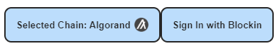
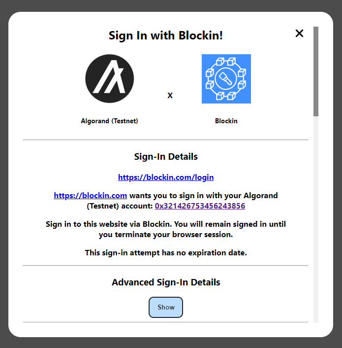
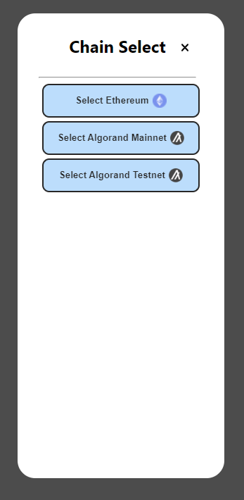

<div id="top"></div>
<!--
*** Thanks for checking out the Best-README-Template. If you have a suggestion
*** that would make this better, please fork the repo and create a pull request
*** or simply open an issue with the tag "enhancement".
*** Don't forget to give the project a star!
*** Thanks again! Now go create something AMAZING! :D
-->


<!-- PROJECT SHIELDS -->
<!--
*** I'm using markdown "reference style" links for readability.
*** Reference links are enclosed in brackets [ ] instead of parentheses ( ).
*** See the bottom of this document for the declaration of the reference variables
*** for contributors-url, forks-url, etc. This is an optional, concise syntax you may use.
*** https://www.markdownguide.org/basic-syntax/#reference-style-links
-->
[![Contributors][contributors-shield]][contributors-url]
[![Forks][forks-shield]][forks-url]
[![Stargazers][stars-shield]][stars-url]
[![Issues][issues-shield]][issues-url]
[![MIT License][license-shield]][license-url]


<!-- PROJECT LOGO -->
<br />
<div align="center">
  <a href="https://trevormil.gitbook.io/blockin/">
    
  </a>

  <h3 align="center">Blockin</h3>

  <p align="center">
    A multi-chain sign-in standard for Web 3.0!
    <br />
    <a href="https://trevormil.gitbook.io/blockin/"><strong>Explore the docs »</strong></a>
    <br />
    <br />
    <a href="https://blockin.vercel.app/">View Demo</a>
    ·
    <a href="https://github.com/matt-davison/blockin/issues">Report Bug</a>
    ·
    <a href="https://github.com/matt-davison/blockin/issues">Request Feature</a>
  </p>
</div>


<!-- ABOUT THE PROJECT -->
## About The Project

Blockin is a universal, multi-chain sign-in interface for Web 3.0 that supports micro-authorizations! 

This README focuses mainly on this codebase. The [`Blockin Docs`](https://blockin.gitbook.io/blockin/) and the [`Blockin Demo`](https://blockin.vercel.app/) provide much more documentation on what Blockin is, how it works, and how to use it.

## Scope of the Library
This library supports creating digital authorization assets, such as NFTs, on any blockchain that supports them, as well as generating and verifying sign-in requests in the form of a challenge / response. 

Note that the Blockin library does not handle signing the challenges and will never ask for your private key. It only uses public data and cryptographic signatures to verify.

<!-- USAGE EXAMPLES -->
## Usage

For using the Blockin library on either a backend or frontend codebase, all you will have to do is run 
```
npm install blockin
```

Then, you can import any function via 
```TSX
import { ... } from 'blockin';'
```
Visit the [`Blockin Docs`](https://blockin.gitbook.io/blockin/) for documentation on how to use this library.

An example frontend and backend using Blockin can be found at [`Blockin Sample Integration Site`](https://github.com/Blockin-Labs/Blockin-Sample-Integration). 
* The pages folder shows how to use it in the frontend. The api folder shows how to use it via a backend API.

## Current Supported Chains
These are the chains that are natively supported by this library.
* **Algorand** (AlgoDriver) via the blockin-algo-driver NPM package ([`Source Code`](https://github.com/Blockin-Labs/blockin-algo-driver)).
  * Uses Purestake API and algosdk npm library

To add support for a new blockchain, please visit the README in the ChainDrivers folder.

We are currently working on adding implementations for more blockchains and also making it more convenient to import/export these templates.

## Example Sites Using Blockin
* [`Netflix Proof of Concept`](https://github.com/Blockin-Labs/Blockin-Sample-Integration)

## Contributing to the Library
To develop and contribute to this library directly, all you should need to do is ```npm install```. 

The library has a few separate parts to it:
* Smart Contracts: These live in the smart_contracts folder. This is where example smart contracts for the creation of assets and other use case examples can be found.
* Blockin Library Functions: These live in the src folder (excluding the src/ui folder). This is for all the asset creation and verification functions.
  * If contributing to this part of the library, it is important that you become familiar with the ChainDriver interface and how it used. More information can be found at [`Blockin Docs`](https://blockin.gitbook.io/blockin/).
* UI Components: These importable UI components can be found in the src/ui folder. This, in theory, should be decoupled from the core library and able to eventually become its own library in the future.
  * View the README in src/ui for more information.
  * 
  * 
  * 


Everything is built using ```npm run build``` which creates a build folder in the ```dist``` directory. The build command first rolls up the UI components, and then it builds everything else.


## Documentation
For more in-depth documentation, visit the [`Blockin Docs`](https://blockin.gitbook.io/blockin/) or the [`Blockin Paper`](https://github.com/kking935/Blockin-Demo).


<!-- MARKDOWN LINKS & IMAGES -->
<!-- https://www.markdownguide.org/basic-syntax/#reference-style-links -->
[contributors-shield]: https://img.shields.io/github/contributors/matt-davison/blockin.svg?style=for-the-badge
[contributors-url]: https://github.com/matt-davison/blockin/graphs/contributors
[forks-shield]: https://img.shields.io/github/forks/matt-davison/blockin.svg?style=for-the-badge
[forks-url]: https://github.com/othneildrew/Best-README-Template/network/members
[stars-shield]: https://img.shields.io/github/stars/matt-davison/blockin.svg?style=for-the-badge
[stars-url]: https://github.com/othneildrew/Best-README-Template/stargazers
[issues-shield]: https://img.shields.io/github/issues/matt-davison/blockin.svg?style=for-the-badge
[issues-url]: https://github.com/othneildrew/Best-README-Template/issues
[license-shield]: https://img.shields.io/github/license/matt-davison/blockin.svg?style=for-the-badge
[license-url]: https://github.com/othneildrew/Best-README-Template/blob/master/LICENSE.txt
[product-screenshot]: images/screenshot.png
